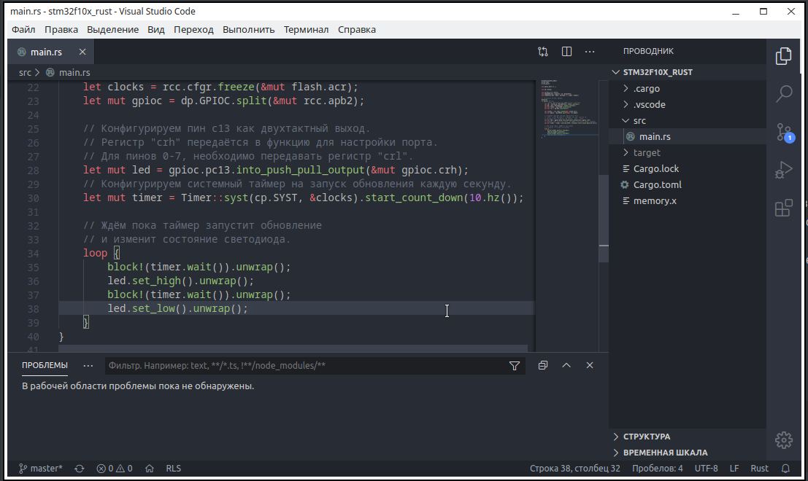

# История о том, как собрать вкусную среду для ARM

В один прекрасный день появилась необходимость в гибкой и функциональной среде разработки, под stm32. Взор упал на молодой продукт от ST? под названием **STM32CubeIDE**, он хорош. Основное преимущество, это работа из коробки с достаточно широкими функциональными возможностями. К большому сожалению она базируется на **Eclipse**, хотя многие назовут это плюсом. Недостатки: очень прожорливая, медленная, интуитивно не понятная, устаревший дизайн. О преимуществах рассказывать не буду, раз вы это читаете, значит вы уже все сами знаете :)
Мой взор упал на VSCode, по сравнению с конкурентами он быстрый, хорошо поддерживается, ну и конечно же бесплатная. не будем тянуть, приступим к делу. 
Стоит отметить, все проверялось на Kubuntu 19.10 и китайском ST-Link2 и Bluepill

## Начнем с C/C++

Жизненно необходимые пакеты, без них будет сложно. Необходимы для сборки и менеджмента проектом.

~~~bash
sudo apt install git
sudo apt install make
sudo apt install mс
~~~

### Первый шаг. ToolChain

Качаем с официального сайта, в репозитории (Ubuntu) очень обрезанная версия, не годится она под наши нужды.

https://developer.arm.com/tools-and-software/open-source-software/developer-tools/gnu-toolchain/gnu-rm/downloads

Распаковать в каталог /opt/gcc-arm/ с помощью Midnight Commander (mc), не забываем про root права. 

Для удобства использования, пропишем в PATH, это позволит запускать приложения без полного пути
~~~bash
nano /home/user/.bashrc
~~~
Добавляем в конец файла такую строку
~~~bash
export PATH=/opt/gcc-arm/bin:$PATH
~~~

Проверим работоспособность компилятора, если все **ок**, продолжаем дальше

~~~bash
arm-none-eabi-gcc --version
~~~

Проверяем работоспособность пакета отладки

~~~bash
arm-none-eabi-gdb
~~~

В случае ошибки, устанавливаем дополнительные библиотеки 

~~~bash
sudo apt-get install ia32-libs
sudo apt-get install libncurses5:amd64
~~~

### Установим систему отладки 

~~~bash
sudo apt-get install openocd
~~~

Проверим корректность установки, проблем обычно не возникает с этим пакетом. 

~~~bash
openocd --version
~~~

### Установим пакеты для работы с STLINK

~~~bash
sudo apt install stlink-tools
~~~

Не ленимся проверить работоспособность, в последствии сложно будет найти не функционирующий узел нашей системы. 

~~~bash
st-info
~~~

Если пакет установлен, можно подключить какой нибудь контроллер через ST-Link и попытаться получить информацию 

~~~bas
st-info --probe
~~~

Мало ли пригодится, с помощью этой команды можно сразу прошить контроллер Bin файлом 

~~~bash
st-flash write ./miniblink.bin 0x8000000
~~~

### Приближаемся непосредственно к среде разработки 

Качаем STM32cubeMX, он необходим что бы с генерировать проект, да и в принципе без него сложно представить разработку, очень удобный инструмент.

https://www.st.com/en/development-tools/stm32cubemx.html

Распаковываем и запускаем через терминал (не удивляйтесь, файл exe), должны увидеть процесс установки, следуем инструкциям. Я устанавливаю в директорию /opt

~~~bash 
java -jar SetupSTM32CubeMX-4.11.0.exe
~~~

### Самое время создать проект 

Необходимо генерировать проект для целевого микроконтроллера, с помощью STM32cubeMX. 
В настройках, в качестве toolchain, указываем makefile.

Хороший человек **damogranlabs** написал script,  позволяющий в пару кликов преобразовывать проект stm32 в проект для VSCode. Это очень упрощает дальнейшую работу. 

~~~bash
git clone https://github.com/damogranlabs/VS-Code-STM32-IDE
~~~

Не забывайте. Перед выполнением данной команды, лучше быть уже в своей рабочей директории

### Установка и настройка IDE

Установим python3, он нам понадобится для завершения генерации проекта

~~~bash
sudo apt install python3
sudo apt install python3-pip
~~~

Настало время….. установить среду, а точнее IDE

~~~bash 
sudo apt install code
~~~

Для работы потребуется расширение Cortex-Debug, собственно это и есть “мост” между отладчиком и IDE, ради которого столько стараний.

### Компиляция проекта

Открыть каталог проекта созданный CubeMX, в VSCode
Сохраняем  WorkSpace (подпункт меню Файл) в корень каталога.

Осталось скопировать папку **ideScripts** (из VS-Code-STM32-IDE) в корень нашего проекта. 

Для окончательной настройки, запускаем script нашего товарища. Лучше это сделать прямо в IDE, через встроенный терминал 

~~~bash
python3 ./ideScripts/update.py
~~~

Далее следуем инструкции. Необходимо вписать все пути которые он требует (подробнее это описано в README.md автора)
У меня не получилось использовать конфигурационные файлы, идущие вместе с openocd, скрипт их просто не видел. Необходимые файлы я нашел на просторах интернета. Рекомендую поместить их сразу в  каталок .vscode нашего проекта. Вам точно потребуются  stlink-v2.cfg, stm32f1xx.cfg, STM32F103xx.svd, для них лучше указать относительный путь (пример ./.vscode/stlink-v2.cfg).

## Почему бы не попробовать Rust ?!

Уже было много разговоров о преимуществах этого языка. О безопасности этого языка, его быстродействие, сравнимой с CPP. Пока что он, относительно, молод. В первом приближение можно сказать, у этого языка есть потенциал, это то что, скорее всего, заменить C/C++ в будущем.
Я немного постарался, и написать Bash скрипт. Который позволяющий в два клика собирать проект, для VSCode + Stm32 + Rust. Хотелось бы сразу сказать спасибо [smallnibbler](https://habr.com/ru/users/smallnibbler/) за хорошую статью, на основе которой он был и сделан. 

### Установим пакеты для компиляции новомодного языка

~~~ bash
sudo apt install curl
curl --proto '=https' --tlsv1.2 -sSf https://sh.rustup.rs | sh
~~~

После предыдущего пункта, предается перезагружаться.  Настало время проверить работоспособность Rust.

~~~ bash
rustc --version
~~~

Устанавливаем полезное расширение, позволяющие преобразовывать elf в bin, подходящей к любому программатору.

~~~ bash
cargo install cargo-binutils
rustup component add llvm-tools-preview
~~~

Не забываем в VS Code установить расширение Rust (rls).

### Создание проекта

Тут все горазд проще, чем с C/C++.

Клонируем репозиторий в свою рабочую папку. 

~~~bash
git clone https://github.com/MuratovAS/VSCode-Stm32-Universal
~~~

В случае Stm32f103, имеется уже собранный проект, но куда интереснее собрать его самому. SVD файл можно взять в .vscode/STM32F103xx.svd 
Каталог .vscode может быть скрыт в вашем файловом менеджере, включите “видимость скрытых файлов”.

Из репозитория нам понадобится файл **ProjectGenerator_Rust.sh**, это и есть генератор. Его и SVD необходимо переместить в каталог ваших экспериментов. В процессе он создаст новую папку, для конкретного проекта. 

~~~bash
bash ProjectGenerator_Rust.sh
~~~

Выполняем и следуем инструкции. В скобках приведены примеры. Отличие от скрипта для C/C++ в том, что  нужно использовать конфигурационные файлы от openocd. SVD файла придется найти самому и поместить в одну папку с *ProjectGenerator_Rust*. Это очень **важно**. 

## Немного о USB-COM

в Linux имеется проблема с подключением USB-COM переходников, по причине серьезной системе прав, но это можно исправить.

Сначала нужно узнать VendorID и ProductID нашего переходника. Это можно сделать такой командой:

~~~
lsusb | grep UART
~~~

В результате получим что то подобное: 

~~~bash 
 Bus 003 Device 011: ID 0403:6001 Future Technology Devices International, Ltd FT232 USB-Serial (UART) IC
~~~

Запомните значения после аббревиатуры ID, они нам еще пригодятся. 

Теперь создаем файл в /etc/udev/rules.d/

~~~bash
sudo nano /etc/udev/rules.d/10-ft232.rules
~~~

В качестве называния удобно указать наименования чипа, установленного в переходнике. В моем случае это FT232.

Теперь добавляем в открывшемся окне содержимое (изменяем, если нужно idVendor и idProduct, эти значения мы получили в предыдущем пункте):

~~~bash
SUBSYSTEMS=="usb", ATTRS{idVendor}=="0403", ATTRS{idProduct}=="6001", \
    MODE:="0666", GROUP:="users",\
    SYMLINK+="ft232_%n"
~~~

Этой записью мы устанавливаем на USB устройство 0403:6001 права на запись и чтение, обычным пользователям. А также говорим udev создавать символьную ссылку на него с именем ft232_номер.

Перезагружаем udev.

~~~bash
sudo udevadm control --reload-rules
~~~

Теперь проверяем права на наше устройство.

~~~bash
$ ls -l /dev/ | grep USB
lrwxrwxrwx. 1 root root             7 янв 25 15:09 ft232_0 -> ttyUSB0
crw-rw-rw-. 1 root users     188,   0 янв 25 15:09 ttyUSB0
~~~

Как видим нам удалось достичь желаемого результата. Теперь можно обращаться к этому порту без Root прав из любого удобного приложения.

Спасибо. да, это конец  ^ _ ^

