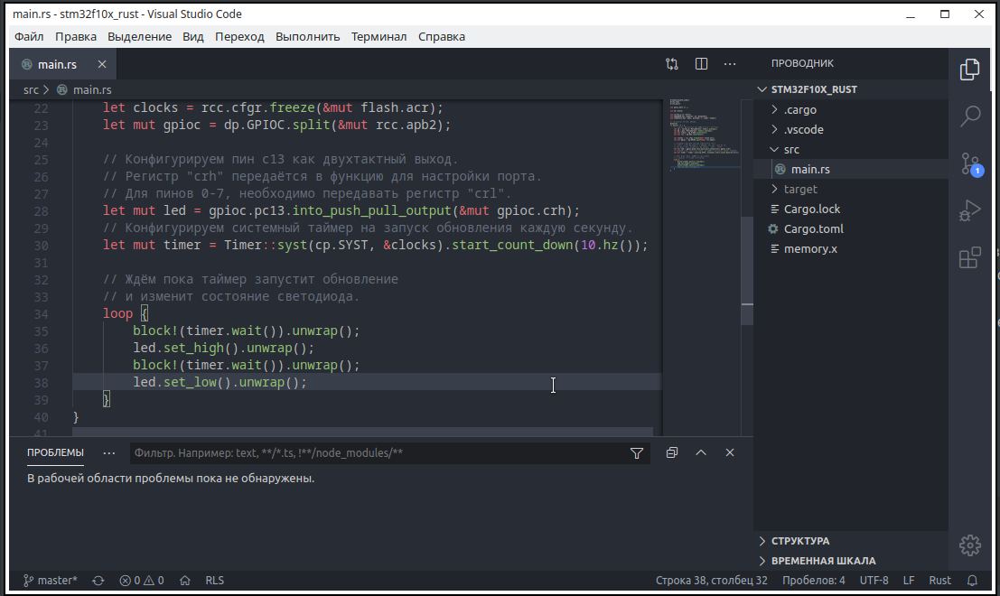
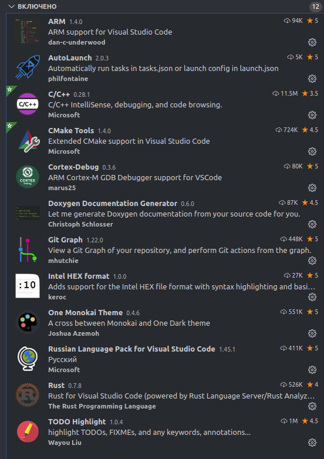
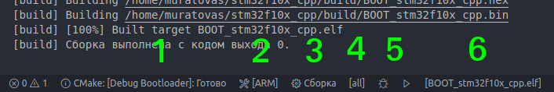
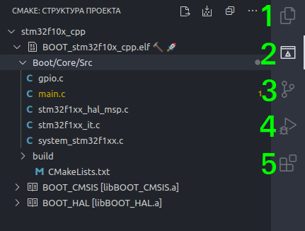

# Внимание!


Примеры в этом репозитории являются **не доработанными** и **устаревшими**!!! Поддерживатся репозиторий больше не будет, рекомендую использовать **новую** систему сборки https://github.com/MuratovAS/VScode_Docker_Stm32

# История о том, как собрать вкусную среду для ARM

VSCode + STM32Cube + GCC [+ СPP + CMake] [+ Rust]  = IDE




В один прекрасный день, появилась необходимость в гибкой и функциональной среде разработки, под stm32. Взор упал на молодой продукт от ST, под названием **STM32CubeIDE**. Он действительно хорош. Основное **преимущества**: работа из коробки, широкие функциональные возможности. К большому сожалению она базируется на **Eclipse**, хотя, многие назовут это плюсом. **Недостатки**: очень прожорливая, медленная, интуитивно не понятная, устаревший дизайн. Если для вас это не критично и вы обойтись сложностей, дальше можно не читать :)
Мой взор упал на **VSCode**, он быстрый, хорошо поддерживается, имеет великолепную базу дополнений, ну и конечно же бесплатный. Так же существует тормозной atom, платный clion. Не будем тянуть, приступим к делу. 
Стоит отметить, все происходило на Ubuntu 20.04 c использованием китайского ST-Link2 (модифицированный) и Bluepill (stm32f10cc8t6)

Про доработка ST-Link2 можно почитать здесь: https://habr.com/ru/post/402927/

[TOC]

------

## Подготовка рабочего пространства

Жизненно необходимые пакеты, без них будет сложно. Необходимы для сборки и менеджмента проектов.

~~~bash
sudo apt install git
sudo apt install make
sudo apt install mс
~~~

### Установим ToolChain

ToolChain — набор созданных в рамках проекта пакетов программ, необходимых для компиляции и генерации выполняемого кода из исходных текстов.

Качаем с официального сайта, в репозитории (Ubuntu) очень обрезанная версия, не годится под наши нужды.


https://developer.arm.com/tools-and-software/open-source-software/developer-tools/gnu-toolchain/gnu-rm/downloads

Необходимо распаковать в каталог **/opt/gcc-arm/** , с помощью Midnight Commander (mc), не забываем про **root** права. 


Для удобства использования, пропишем в **PATH**, это позволит запускать приложения без полного пути
~~~bash
sudo nano /home/user/.bashrc
~~~
Добавляем в конец файла такую строку
~~~bash
export PATH=/opt/gcc-arm/bin:$PATH
~~~

Проверим работоспособность компилятора, если все **ок**, продолжаем дальше

~~~bash
arm-none-eabi-gcc --version
~~~

Проверяем работоспособность пакета отладки

~~~bash
arm-none-eabi-gdb
~~~

В случае ошибки, устанавливаем дополнительные библиотеки 

~~~bash
sudo apt-get install ia32-libs
sudo apt-get install libncurses5:amd64
~~~

### Установим систему отладки 

~~~bash
sudo apt-get install openocd
~~~

Проверим корректность установки, проблем обычно не возникает с этим пакетом. 

~~~bash
openocd --version
~~~

### Установим пакеты для работы с STLINK

~~~bash
sudo apt install stlink-tools
~~~

Не ленимся проверить работоспособность. В последствии, сложно будет найти не функционирующий узел нашей системы. 

~~~bash
st-info
~~~

Если пакет установлен, можно подключить какой нибудь контроллер через ST-Link, и попытаться получить информацию 

~~~bas
st-info --probe
~~~

Мало ли пригодится, с помощью этой команды можно сразу прошить/считать контроллер из/в Bin файл 

~~~bash
st-flash write ./default.bin 0x8000000
st-flash read ./default.bin 0x08000000 0x10000 #(64K)
~~~

Для любителей графических интерфейсов можно установить дополнительный пакет. Мне он показался совершенно бесполезным

~~~ bash
sudo apt install stlink-gui
~~~

### Установка приложений STMicroelectronics

Как известно, большинство продуктов от ST для работы требуют JAVA. 
В мире linux существует как минимум 2 реализации, **open java** и **oracle java**. В репозитории ubuntu можно найти только первый вариант. Второй, проприетарный вариант придется устанавливать вручную. Если планируете использовать только **СubeMX** достаточно открытой реализации, а вот для **CubeProg** требуется уже именно Oracle версия. Так что тут выбор за вами, я установил oracle версию. 

**Установка open версии, очень простая**

```bash
sudo apt install openjdk-8-jdk
sudo apt install openjdk-8-jre
```

**Установка oracle java**

Для начало её нужно скачать. например с оф. сайта https://www.java.com/ru/ 

Затем распакуем архив в */usr/lib/jvm* с помощью все то го же **mc** и root прав.

Теперь нам необходимо создать символьные ссылки, на установленную версию java

```bash
sudo update-alternatives --install "/usr/bin/java" "java" "/usr/lib/jvm/jre1.8.0_251/bin/java" 1500
sudo update-alternatives --install "/usr/bin/javaws" "javaws" "/usr/lib/jvm/jre1.8.0_251/bin/javaws" 1500
```

Зададим переменную JAVA_HOME, которую используют некоторые приложения. Для этого добавляем в файл */etc/environment* следующую строку

```bash
sudo nano /etc/environment
#JAVA_HOME="/usr/lib/jvm/jre1.8.0_251"
```

Сохраняем его и применяем изменение, а так же проверим работоспособность

```bash
source /etc/environment
java -version
```

Наконец то, можем скачать и установить **STM32cubeMX**. Он необходим что бы генерировать проект. В принципе, без него сложно представить разработку. Очень удобный инструмент.


https://www.st.com/en/development-tools/stm32cubemx.html

Распаковываем и запускаем через терминал (не удивляйтесь, файл exe). 

Должны увидеть процесс установки. Следуем инструкциям. Я устанавливаю в директорию ~/ST/STM32CubeMX

~~~bash 
java -jar SetupSTM32CubeMX-4.11.0.exe
~~~

### Установка и настройка IDE

Настало время….. установить среду разработки, а точнее мощный текстовый редактор

~~~bash 
sudo apt install code
~~~

Для работы потребуется некоторые  расширения. Я по рекомендую такой набор, идеально подходящих для embedded. Подробнее, зачем они нужны, можно почить в описание :)



------

## Самое время создать проект 

С этого момента наши пути могут разойтись. Предлога 2 способа, “Простой проект“ и “Серьезный проект“. Стоит отметить, проекты в этом репозиторие **сугубо демонстрационные**, некоторый код в них абсурден.
### Простой проект

Отлично подходит для любительских проектов, с одним контроллером, без собственного bootloader’а. 
Основное **преимущество**, это быстрое и простое разворачивания проекта. Нет необходимости в ручной коррекции конфигурационных файлов, весь процесс автоматизирован. Из **недостатков**: весьма сложно что то изменить в структуре проекта, совершенно не гибкая система. Проект может быть написан **только на GCC**.

Для начало необходимо установить **python3**, он нам понадобится для завершения генерации проекта.

~~~bash
sudo apt install python3
sudo apt install python3-pip
~~~

В STM32cubeMX необходимо создать проект. Указав в настройках makefile в качестве toolchain.

Хороший человек, **damogranlabs** написал Script,  позволяющий в пару кликов преобразовывать проект cubeMX в проект для VSCode. Это очень упрощает дальнейшую работу. Клонируем его репозиторий.

~~~bash
git clone https://github.com/damogranlabs/VS-Code-STM32-IDE
~~~

Не забывайте. Перед выполнением данной команды, лучше быть уже в своей рабочей директор.

Открыть каталог проекта созданный CubeMX, в VSCode. Сохраняем  WorkSpace (подпункт меню Файл) в корень каталога.

Осталось скопировать папку **ideScripts** (из VS-Code-STM32-IDE) в корень нашего проекта. 

Для окончательной настройки, запускаем Script нашего товарища. Лучше это сделать прямо в IDE, через **встроенный терминал** (запустить его можно через соответствующую кнопку верхнего меню). Далее следуем инструкции. 

~~~bash
python3 ./ideScripts/update.py
~~~

Необходимо вписать все пути, которые он требует (подробнее это описано в README автора).
*P.S.* У меня не получилось использовать конфигурационные файлы, идущие вместе с openocd, скрипт их просто не видел. Необходимые файлы я нашел на просторах интернета. Рекомендую поместить их сразу в  каталок .vscode проекта. Вам точно потребуются файлы stlink-v2.cfg, stm32f1xx.cfg, STM32F103xx.svd, для них лучше указать относительный путь (пример *./.vscode/stlink-v2.cfg)*.

В целом, проект готов. Можно писать и отлаживать код.

Пример проекта расположен в каталоге *stm32f10x_gcc*

### Серьезный проект 

Тут гораздо все интереснее. Отлично подходит для сложных много-контрроторных систем, но за это приходится платить ручной конфигурация системы сборки. За то, получаем очень гибкую систему. **Преимущество** в рамках одного проекта можно компилировать код **сразу на несколько разных контроллеров**. Так же, можно в разных проектах использовать **общую кодовую базу**. Можно использовать несколько **разных компиляторов**, следственно и языков, к примеру **CPP** и **GCC**. Очень удобный **выбор типа сборки**, Debug или Release. Все что вы сможете придумать, скорее всего можно реализовать в рамках такой системы. **Недостатком** является достаточно **сложная настройка**, по cmake существуют даже книги :)

Сразу стоит отметить особенности данной системы сборки. Конечно, все что вам не нужно, вы можете отключить самостоятельно.

- Директория **Build монтируется в RAM**, при старте VScode, что позволяет ускорить сборку и снизить нагрузку на накопитель (hdd/ssd). Build уничтожается при от монтирование или перезагрузки ПК
- Реализована **SWV** (SWO trace) в рамках IDE. Это позволяет выводить информацию с МК через printf.
- Проект сразу разделен на APP (основная программа) и BOOT (кастомный загрузчик)
- Множество полезных утилит запускаемых через “задачи” в VScode

#### Рассмотрим основные элементы интерфейса

Нижнее меню:



1. Выпадающее меню выбора сборки, здесь **указываем с каким под проектом работаем** в текущий момент. В примере есть возможность выбора APP или BOOT, Debug или Release
2. Меню выбора ToolChain, здесь мы указываем какой набор компиляторов используем в текущий момент.
3. Основная кнопка, **запуск сборки** цели
4. Выбор цели сборки, практически всегда можно использовать [all]. С помощью этого пункта можно скомпилировать конкретную часть под проекта, например драйвер или библиотеку.
5. Самые бесполезные кнопки, у меня так и не вышло заставить их работать с  embedded проектом. В будущем возможно найдется способ починить эти кнопки.
6. Выбор цели отладки, тут у нас нет выбора. Практически всегда она автоматически определяет elf файл который мы только что компилировали. иногда приходится однократно клацнуть на нее.

Боковая панель:



1. Встроенный проводник, с его помощью можно работать непосредственно с фалами
2. В какой то степени то же проводник, но уже по конкретному проекту. Здесь мы можем отчистить сбоку выбрать цели
3. Git менеджер, показывает список изменений с предыдущего коммита 
4. **Отладка**. Именно через это меню её необходимо запускать, работает в автоматическом режиме через openocd
5. Менеджер расширений, с ним познакомились еще в процессе установки IDE

#### Немного о структуре проекта

- App - тут хранится код основной прошивки, по совместительству cubemx проект
    - App.cmake - информация для системы сборки как собирать данный под проект
- Boot - тут хранится код  кастомного загрузчика, по совместительству cubemx проект
    - Boot.cmake -  информация для системы сборки как собирать данный под проект
- build -  каталог с файлами жизнедеятельности сборки, тут  хранятся собранные elf, bin, т.д.
- cmake - для системы сборки
    - CompilerSelectro.cmake - список компиляторов, меня его нет необходимости
    - stm32f103.cmake - параметры сборки исходников **для конкретного МК**, именно здесь указывается архитектура **ядра**, определяется режим работы **FPU**  
- openocd - для системы отладки
    - STLink-SWD.cfg - настройки отладчика, именно в нем указывается **путь к *.cfg* для вашего МК** и программатора
    - STLink-SWV.cfg - настройки SWV режима
    - STM32F103xx.svd - файл описывающий регистры конкретного МК, этот файл указан в *launch.json*
    - tools/AutoSWV.sh - скрипт для удобного вывода сообщений из SWO, так же в этой директории расположены необходимые утилиты для паркинга потока.
- .vscode - конфигурации IDE
    - c_cpp_properties.json - настройки intelliSense. Тут **необходимо** прописать пути к всем *header*  файлам проекта, а так же *defines* для вашего МК
    - cmake-kits.json - прописывает пути до компиляторов
    - launch.json - описывает то, как запускать отладку. тут указать **путь до .svd** файла 
    - tasks.json - весьма объемный файл, хранит в себе все пользовательские задачи для IDE. Без необходимости не трогаем.
- CMakeLists.txt - основной файл системы сборки, тут указывается **имя проекта**, используемые языки и контроллер 
- cmake-variants.json - описывает все разновидность под проектов.
- STM32F103C8Tx_FLASH.ld.in -  файл **скопированный из cube** проекта и модифицирован. добавляется на конце *.in*, если файл будет пересоздан для каждого под проекта. в файле присутствуют переменные *${}*
- .gitignore - список того что не требуется в контроле git системой

Пример проекта расположен в каталоге *stm32f10x_cpp*

------

## Почему бы не попробовать Rust ?!

Уже было много разговоров о преимуществах этого языка. О безопасности этого языка, его быстродействие сравнимой с CPP. Пока что он, относительно, молод. В первом приближение можно сказать, у этого языка есть потенциал, это то, что скорее всего, заменить C/C++ в будущем.
Я немного постарался, и написать Bash скрипт. Который позволяющий в два клика собирать проект, для VSCode. Хотелось бы сразу сказать спасибо [smallnibbler](https://habr.com/ru/users/smallnibbler/) за хорошую статью, на основе которой он был и сделан. 

**Важный момент**. HAL на Rust для разных семейств МК, разный. Пример кода, создаваемый скриптом, может у вас не заработать. 

### Установим пакеты для компиляции новомодного языка

~~~ bash
sudo apt install curl
curl --proto '=https' --tlsv1.2 -sSf https://sh.rustup.rs | sh
~~~

После предыдущего пункта, предается перезагружаться.  Настало время проверить работоспособность Rust.

~~~ bash
rustc --version
~~~

Устанавливаем полезное расширение, позволяющие преобразовывать elf в bin, подходящей к любому программатору.

~~~ bash
cargo install cargo-binutils
rustup component add llvm-tools-preview
~~~

Не забываем в VS Code установить расширение Rust (rls).

### Создание Rust проекта

Тут все горазд проще, чем с C/C++.

Клонируем репозиторий в свою рабочую папку. 

~~~bash
git clone https://github.com/MuratovAS/VSCode-Stm32-Universal
~~~

В случае Stm32f103, имеется уже собранный проект, но куда интереснее собрать его самому. 

SVD файл можно взять в .vscode/STM32F103xx.svd 
Каталог .vscode может быть скрыт в вашем файловом менеджере, включите “видимость скрытых файлов”.

Из репозитория нам понадобится файл **ProjectGenerator_Rust.sh**, это и есть генератор. Его и SVD необходимо переместить в каталог ваших экспериментов. В процессе он создаст новую папку, для конкретного проекта. 

~~~bash
bash ProjectGenerator_Rust.sh
~~~

Выполняем и следуем инструкции. В скобках приведены примеры. Отличие от скрипта для C в том, что  нужно использовать конфигурационные файлы от openocd. SVD файла придется найти самому и поместить в одну папку с *ProjectGenerator_Rust*. Это очень **важно**. 

Пример проекта расположен в каталоге *stm32f10x_rust*

------

## Немного о USB-COM

в Linux имеется проблема с подключением USB-COM переходников, по причине серьезной системе прав, но это можно исправить.

Сначала нужно узнать VendorID и ProductID нашего переходника. Это можно сделать такой командой:

~~~
lsusb | grep UART
~~~

В результате получим что то подобное: 

~~~bash 
 Bus 003 Device 011: ID 0403:6001 Future Technology Devices International, Ltd FT232 USB-Serial (UART) IC
~~~

Запомните значения после аббревиатуры ID, они нам еще пригодятся. 

Теперь создаем файл в /etc/udev/rules.d/

~~~bash
sudo nano /etc/udev/rules.d/10-ft232.rules
~~~

В качестве называния удобно указать наименования чипа, установленного в переходнике. В моем случае это FT232.

Теперь добавляем в открывшемся окне содержимое (изменяем idVendor и idProduct, эти значения мы получили в предыдущем пункте):

~~~bash
SUBSYSTEMS=="usb", ATTRS{idVendor}=="0403", ATTRS{idProduct}=="6001", \
    MODE:="0666", GROUP:="users",\
    SYMLINK+="ft232_%n"
~~~

Этой записью мы устанавливаем на USB устройство 0403:6001 права на запись и чтение, обычным пользователям. А также говорим udev создавать символьную ссылку на него с именем ft232_номер.

Перезагружаем udev.

~~~bash
sudo udevadm control --reload-rules
~~~

Теперь проверяем права на наше устройство.

~~~bash
$ ls -l /dev/ | grep USB
lrwxrwxrwx. 1 root root             7 янв 25 15:09 ft232_0 -> ttyUSB0
crw-rw-rw-. 1 root users     188,   0 янв 25 15:09 ttyUSB0
~~~

Как видим нам удалось достичь желаемого результата. Теперь можно обращаться к этому порту без Root прав из любого удобного приложения. Неплохо зарекомендовали себя **PuTTY** и **Termite**

Спасибо. да, это конец  ^ _ ^
